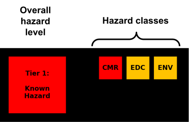
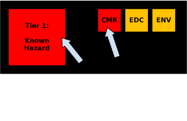
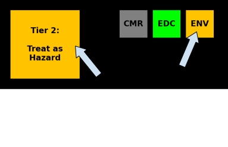
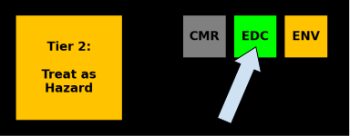
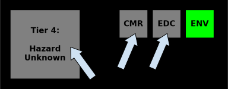

# Understanding the "Tier" graphic

## Graphic structure

{ width="300" align=left }

**Overall Hazard Levels** The large box in the graphic indicates the most concerning hazard level across all classes for the chemical.

**Hazard Class Levels** Smaller boxes in the graphic indicate hazard levels for classes of hazards.

| Abbreviation | Types of hazards |
| :---: | :--- |
| **CMR** | Carcinogenicity, mutagenicity and reproductive hazards |
| **EDC** | Endocrine disruption hazards (note that GHS does not yet have comprehensive classification of EDCs. Therefore, the strongest hazard level in this system is effectively level 2)|
| **ENV** | Acute and chronic environmental hazards |

## Understanding Our Hazard Tier Levels
Our four-tiered system provides an at-a-glance summary of a chemical's hazard profile, ranging from officially recognized dangers to critical data gaps.

---
| Tier color | Tier Level |
| :---: | --- |
|**RED**    { width="300" }| **Tier 1: Known Hazards** Based on the official **Globally Harmonized System (GHS)**. These chemicals have internationally recognized, significant hazards like carcinogenicity, reproductive toxicity, or acute toxicity.|
|**ORANGE**    { width="300" }| **Tier 2: Expanded Perspective** Goes beyond the slow-moving GHS to include more current data from scientific literature, other regulatory agencies, and predictive models. This tier provides a more complete view of potential hazards when the GHS has not formally made conclusions. |
|**GREEN**    { width="300" }| **Tier 3: Demonstrated Low/Moderate Hazard** This is reserved for chemicals without Tier 1 or 2 indicators, but direct studies support a **favorable safety profile** for a given hazard class. |
|**GRAY**    { width="300" }| **Tier 4: Data Deficient** Indicates there is **not enough information** to make a confident hazard assessment. An absence of data does not mean a chemical is safe; it means its risk is unknown and a precautionary approach is warranted.|